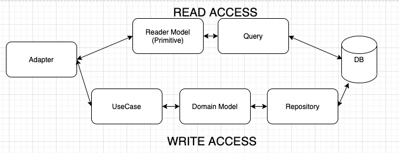

# DDD on Scala Sample
DDDに基づいた実装例として、Scala（PlayFramework）を使って簡易版モンハンの世界を設計/実装した（DDDは設計思想のため具体的な実装方式は複数存在するが、そのうちの一つとしての位置づけ）。

DDDを実践するにあたってのアーキテクチャや考え方の基礎は [KOSKA社](https://www.koska.jp/) で実践しているものを参考とした上で、自分なりに手を加えている。

Golang版はこちら: [ddd_on_golang](https://github.com/yu-croco/ddd_on_golang)

## 構成
アプリケーション全体としては以下の構成となっており、いわゆるオニオンアーキテクチャの形式である。


読み取りアクセス（GET）と書き込みアクセス（POST/PUT/DELETE）では処理フローを以下のように分けている（CQRS）。



## ドメインモデル図
このレポジトリで扱っているドメインモデル図は以下の通り。


## ユースケース図
各ユースケースは対応するShellScriptを用意しているので、サーバーを起動してSeedデータを投入した後に実行することで動作確認することが出来る。

### ハンター主体のケース
- ハンターがモンスターを攻撃する
    - 確認コマンド: `bin/attackMonster.sh`


- ハンターが倒したモンスターから素材を剥ぎ取る
    - 確認コマンド: `bin/getMaterialFromMonster.sh`


### モンスター主体のケース
- モンスターがハンターを攻撃する
    - 確認コマンド: `bin/attackHunter.sh`


## 技術スタック
- Scala v2.12.8
- PlayFramework v2.8
- cats
- Eff
- Domain-Driven Design
- CQRS
- Docker: 19.03.12
- docker-compose: 1.26.2

## DDDらしさを出すためのTips
- Value Objectを生成する際に `必ず成功or失敗のどちらかとなる` ファクトリメソッドを用意することで、オブジェクトの生成が不完全なものとならないようにした（完全コンストラクタの実現）
    - hunterId/monsterIdがそれにあたる（他のValue Objectでは機能としてあまり使用していないので省略）
- [cats](https://github.com/typelevel/cats) を用いることでAdapter層で発生したエラー全てを積み上げ、レスポンスに全件返すようにしている
- [Eff](https://github.com/atnos-org/eff) を用いることでUseCase層での型ネストを解消してコードが仕様を反映している（UseCase層のコードを読むことでそのまま仕様として意味が通る）状態を実現
- 仕様クラスを用いることで、domain層のコードが肥大化しないようにした

## 構成

```
├── Dockerfile
├── DockerfileDb
├── README.md
├── app
│    ├── Module.scala // DI
│    ├── adapter // Adapter layer(e.g. controllers)
│    ├── domain // Domain layer
│    ├── infrastructure // infra layer(e.g. DTO, repositoryImpl)
│    └── usecase // useCase(application) layer
├── bin // 動作確認用のツールなど
├── build.sbt
├── codegen
├── conf
├── docker-compose.yml
...
```

## セットアップ

```bash
$ git clone
# APIの動作確認に使っているShellScriptではjqを使っているので、動作確認したい場合には入れる
$ brew install jq

# 起動
$ docker-compose up
// -> http://localhost:9011/ で起動する

# Seed実行でサンプルデータを投入できる（Seed実行の上で `bin` 配下のスクリプトを流すと各ユースケースの結果が返される）
$ bin/seed.sh
 -> http://localhost:9011/
```

## その他
### UseCase層のモナドトランスファー
- [atnos-org/eff](https://github.com/atnos-org/eff) というライブラリを使用してUseCase層でのモナドトランスファーを実現している
  - Qiitaの[ScalaのEffを使ってDDDのUseCase層をいい感じに書いてみる](https://qiita.com/yu-croco/items/859328beda388f4f4393) に詳細を記載しているので、興味がある方はどうぞ

### Adapter層でのJson変換
- [circe/circe](https://github.com/circe/circe) と、 [jilen/play-circe](https://github.com/jilen/play-circe) というライブラリを使用して、Jsonへの変換処理を行っている

### DBマイグレーション
- [evolutions](https://www.playframework.com/documentation/2.8.x/Evolutions) と [slick-codegen](https://scala-slick.org/doc/3.2.0/code-generation.html) を使っている
  - Qiitaの[PlayFramework(on Scala)にslick(on PostgreSQL)/slick-codegenを入れる](https://qiita.com/yu-croco/items/47dff9d653803fce883a) に詳細を記載しているので、興味がある方はどうぞ

## 参考にした情報
- [j5ik2o/spetstore(github)](https://github.com/j5ik2o/spetstore)
- [ddd-on-scala(github)](https://github.com/crossroad0201/ddd-on-scala)
- [ddd-on-scala(Speaker Deck)](https://speakerdeck.com/crossroad0201/scala-on-ddd)
- [実践DDD本 第7章「ドメインサービス」～複数の物を扱うビジネスルール～](https://codezine.jp/article/detail/10318)
- [混乱しがちなサービスという概念について](https://blog.j5ik2o.me/entry/2016/03/07/034646)
- [scalazやcatsを使ってFunctional DDDを試してみる](https://qiita.com/uryyyyyyy/items/4a846be75f1554727f71)
- [ScalaのEffを使ってDDDのUseCase層をいい感じに書いてみる](https://qiita.com/yu-croco/items/859328beda388f4f4393)
- [Scalaを例に「仕様」パターンを実装する](https://yoskhdia.hatenablog.com/entry/2018/12/06/085621#f-61b9a946)